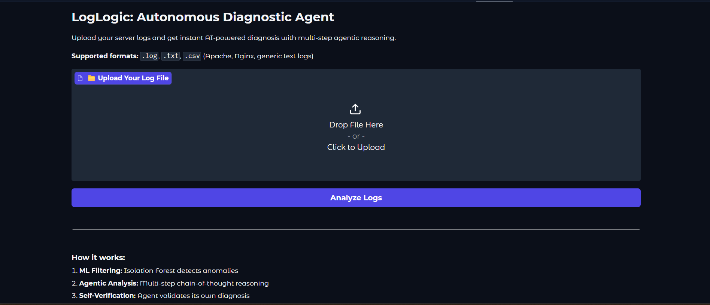
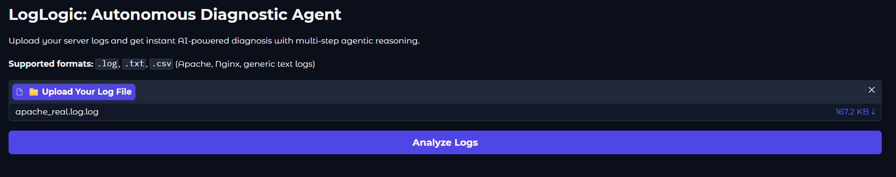
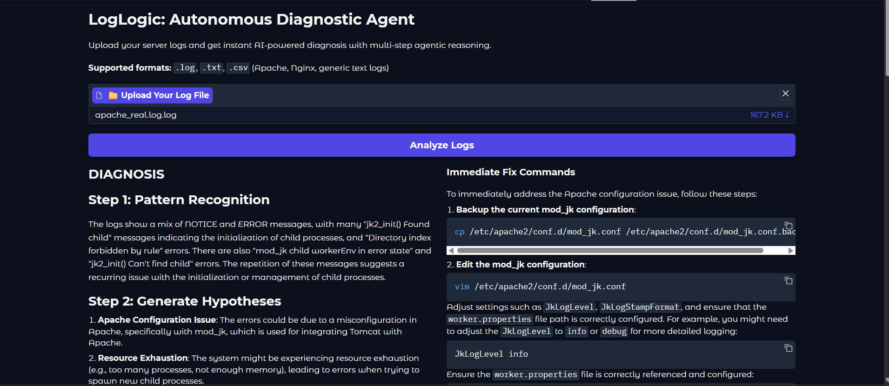
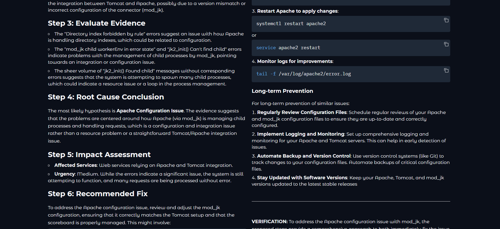

# LogLogic: Autonomous Diagnostic Agent

An AI-powered SRE agent that analyzes server logs using multi-step reasoning, anomaly detection, and self-verification to diagnose issues and suggest fixes.


## Screenshots

| | |
|---|---|
|  |  |
|  |  |


## Features

- **ML-Based Anomaly Detection**: Uses Isolation Forest to filter noise
- **Agentic Analysis**: Multi-step chain-of-thought reasoning
- **Self-Verification**: Agent checks its own diagnoses
- **Automated Fixes**: Generates executable commands with safety checks


## Live Demo

Try it here: [Hugging Face Space](https://huggingface.co/spaces/PandhereAnu/loglogic-agent)


## How to Use

1. Upload your log file (.log, .txt, or .csv)
2. Wait for AI analysis (30-60 seconds)
3. Get diagnosis + recommended fix


## Supported Log Formats

- Apache/Nginx: `[timestamp] [level] message`
- Generic: `timestamp level message`
- CSV: Must have 'timestamp' and 'message' columns


## Run Locally

### Clone the project

```bash
git clone https://github.com/PandhereAnu10/loglogic_agent.git
```


#### Install dependencies

```bash
pip install -r requirements.txt
```

#### Set API key

```bash
export GROQ_API_KEY="your_groq_key_here"
```

#### Run

```bash
python app.py
```


## License

MIT License - see [LICENSE](LICENSE)


## Built With

- [Groq](https://groq.com/) - Fast LLM inference
- [Gradio](https://gradio.app/) - Web interface
- [Scikit-learn](https://scikit-learn.org/) - Anomaly detection

